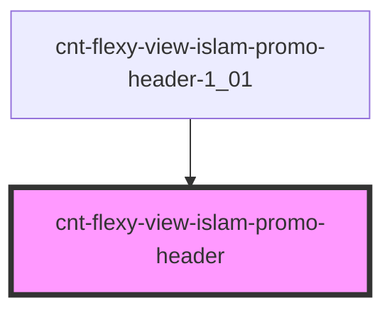

# cnt-flexy-view-islam-promo-header

<!-- Auto Generated Below -->

## Properties

| Property  | Attribute | Description                        | Type                              | Default     |
| --------- | --------- | ---------------------------------- | --------------------------------- | ----------- |
| `intro`   | --        | Приём данных из массива для вывода | `SCntFlexyViewIslamPromoHeader[]` | `[]`        |
| `payload` | `payload` |                                    | `any`                             | `undefined` |

## Events

| Event                         | Description           | Type               |
| ----------------------------- | --------------------- | ------------------ |
| `clickHeaderAboutUsNav`       | Клик по AboutUs       | `CustomEvent<any>` |
| `clickHeaderContactsNav`      | Клик по Contacts      | `CustomEvent<any>` |
| `clickHeaderDeveloper`        | Клик по developer     | `CustomEvent<any>` |
| `clickHeaderHomeNav`          | Клик по Home          | `CustomEvent<any>` |
| `clickHeaderMaleIcon`         | Клик по MaleIcon      | `CustomEvent<any>` |
| `clickHeaderOurTeamNav`       | Клик по OurTeam       | `CustomEvent<any>` |
| `clickHeaderPracticeAreasNav` | Клик по PracticeAreas | `CustomEvent<any>` |

## Dependencies

### Used by

 - [cnt-flexy-view-islam-promo-header-1_01](../../..)

### Graph

----------------------------------------------

*Built with [StencilJS](https://stenciljs.com/)*
