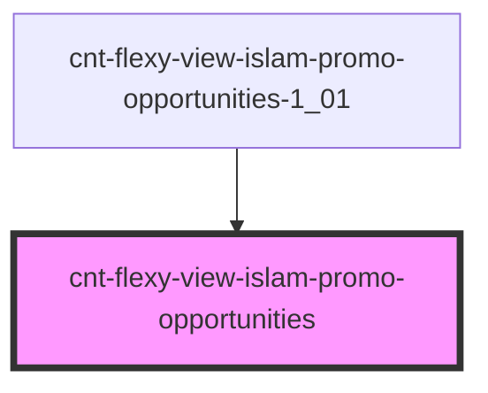

# cnt-flexy-view-islam-promo-opportunities

<!-- Auto Generated Below -->

## Properties

| Property  | Attribute | Description                        | Type                                   | Default     |
| --------- | --------- | ---------------------------------- | -------------------------------------- | ----------- |
| `intro`   | --        | Приём данных из массива для вывода | `SCntFlexyViewIslamPromoOpportunity[]` | `[]`        |
| `payload` | `payload` |                                    | `any`                                  | `undefined` |

## Events

| Event                             | Description                    | Type               |
| --------------------------------- | ------------------------------ | ------------------ |
| `clickOpportunitiesCogIcon`       | Клик по Второй иконке          | `CustomEvent<any>` |
| `clickOpportunitiesCogText`       | Клик по Второму тексту         | `CustomEvent<any>` |
| `clickOpportunitiesCogTitle`      | Клик по Второму под заголовку  | `CustomEvent<any>` |
| `clickOpportunitiesComputerIcon`  | Клик по Первой иконке          | `CustomEvent<any>` |
| `clickOpportunitiesComputerText`  | Клик по Первому тексту         | `CustomEvent<any>` |
| `clickOpportunitiesComputerTitle` | Клик по Первому под заголовку  | `CustomEvent<any>` |
| `clickOpportunitiesHeading`       | Клик по Заголовку              | `CustomEvent<any>` |
| `clickOpportunitiesPictureIcon`   | Клик по Третьей иконке         | `CustomEvent<any>` |
| `clickOpportunitiesPictureText`   | Клик по Третьму тексту         | `CustomEvent<any>` |
| `clickOpportunitiesPictureTitle`  | Клик по Третьему под заголовку | `CustomEvent<any>` |

## Dependencies

### Used by

 - [cnt-flexy-view-islam-promo-opportunities-1_01](../../..)

### Graph

----------------------------------------------

*Built with [StencilJS](https://stenciljs.com/)*
