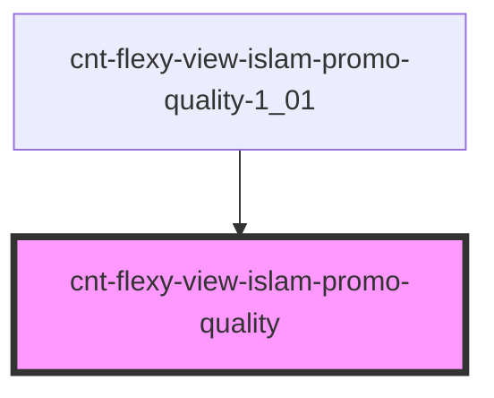

# cnt-flexy-view-islam-promo-quality

<!-- Auto Generated Below -->

## Properties

| Property  | Attribute | Description                        | Type                               | Default     |
| --------- | --------- | ---------------------------------- | ---------------------------------- | ----------- |
| `intro`   | --        | Приём данных из массива для вывода | `SCntFlexyViewIslamPromoQuality[]` | `[]`        |
| `payload` | `payload` |                                    | `any`                              | `undefined` |

## Events

| Event                 | Description       | Type               |
| --------------------- | ----------------- | ------------------ |
| `clickQualityHeading` | Клик по Заголовку | `CustomEvent<any>` |
| `clickQualityIcon`    | Клик по Иконке    | `CustomEvent<any>` |
| `clickQualityText`    | Клик по тексту    | `CustomEvent<any>` |
| `clickQualityTitle`   | Клик по Заголовку | `CustomEvent<any>` |

## Dependencies

### Used by

 - [cnt-flexy-view-islam-promo-quality-1_01](../../..)

### Graph

----------------------------------------------

*Built with [StencilJS](https://stenciljs.com/)*
