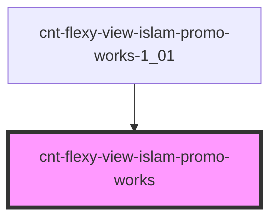

# cnt-flexy-view-islam-promo-works

<!-- Auto Generated Below -->

## Properties

| Property  | Attribute | Description                        | Type                             | Default     |
| --------- | --------- | ---------------------------------- | -------------------------------- | ----------- |
| `intro`   | --        | Приём данных из массива для вывода | `SCntFlexyViewIslamPromoWorks[]` | `[]`        |
| `payload` | `payload` |                                    | `any`                            | `undefined` |

## Events

| Event                  | Description              | Type               |
| ---------------------- | ------------------------ | ------------------ |
| `clickWorksButton`     | Клик по Кнопке           | `CustomEvent<any>` |
| `clickWorksHeading`    | Клик по Заголовку        | `CustomEvent<any>` |
| `clickWorksShopImage`  | Клик по первой картинке  | `CustomEvent<any>` |
| `clickWorksShopText`   | Клик по тексту           | `CustomEvent<any>` |
| `clickWorksWorkImage1` | Клик по второй картинке  | `CustomEvent<any>` |
| `clickWorksWorkImage2` | Клик по третьей картинке | `CustomEvent<any>` |
| `clickWorksWorkText1`  | Клик по тексту           | `CustomEvent<any>` |
| `clickWorksWorkText2`  | Клик по тексту           | `CustomEvent<any>` |

## Dependencies

### Used by

 - [cnt-flexy-view-islam-promo-works-1_01](../../..)

### Graph

----------------------------------------------

*Built with [StencilJS](https://stenciljs.com/)*
